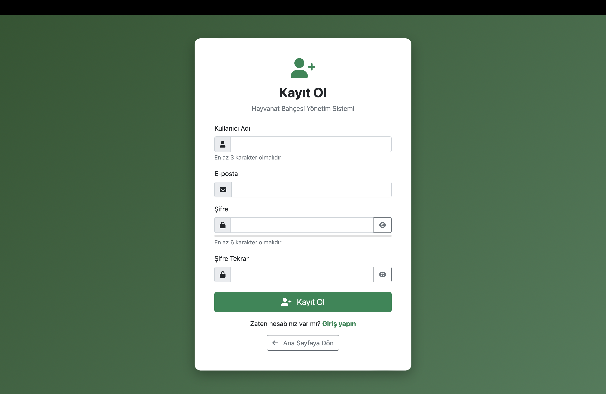
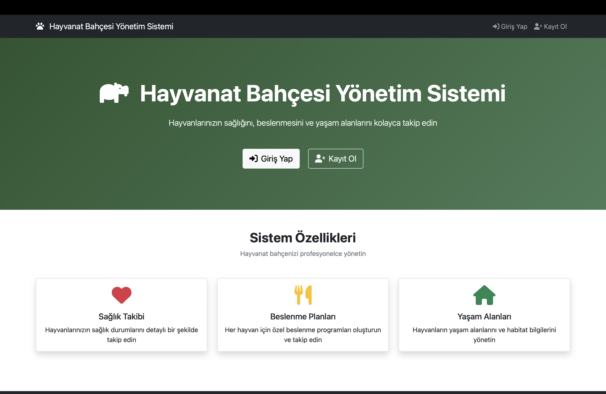
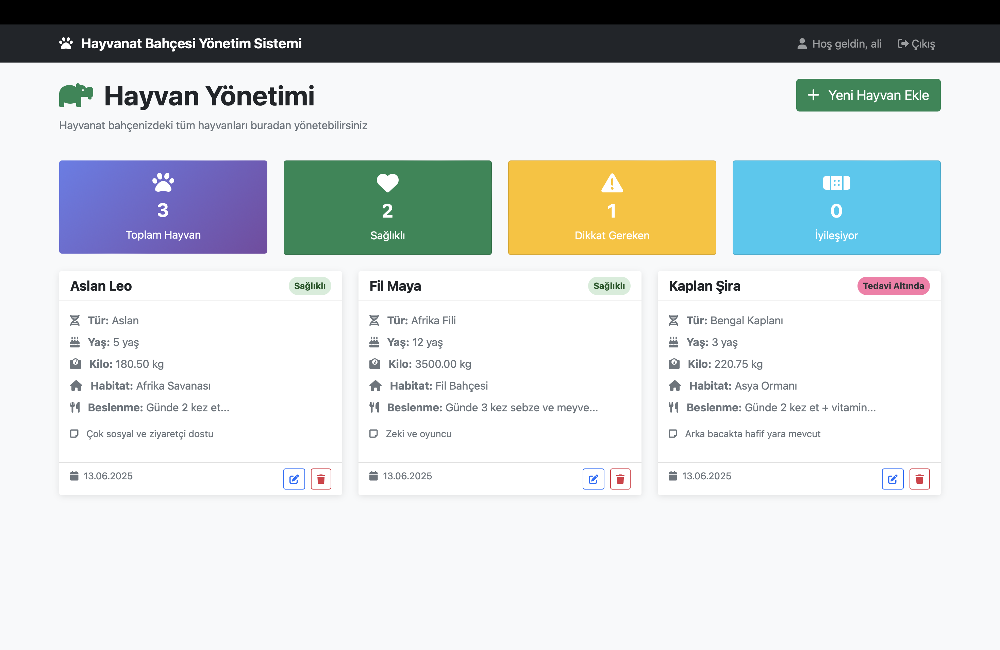
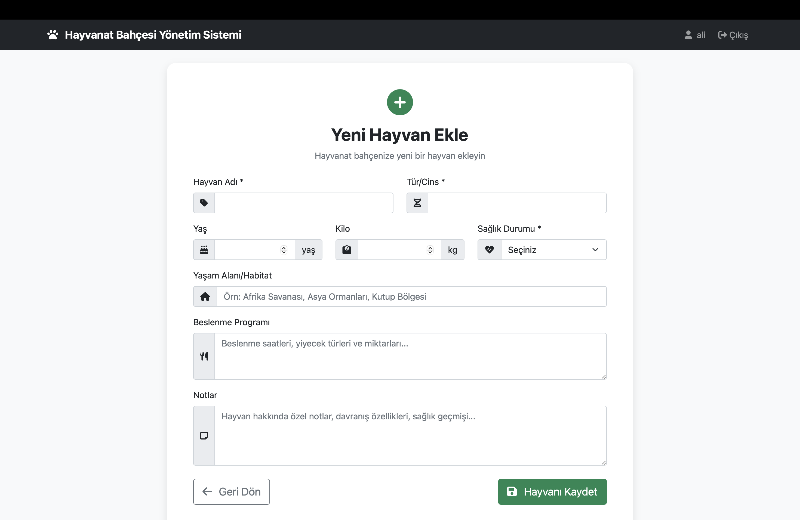

# Hayvanat Bahçesi Yönetim Sistemi

Bu proje, bir hayvanat bahçesindeki hayvanların takibini, sağlık durumlarını, beslenme programlarını ve yaşam alanlarını yönetmek için geliştirilmiş web tabanlı bir uygulamadır.[LİNK](http://95.130.171.20/~st22360859037/)

## Özellikler

- **Kullanıcı Yönetimi**
  - Güvenli kullanıcı kaydı ve giriş sistemi
  - Şifrelerin hash'li şekilde saklanması
  - Oturum yönetimi (session)

- **Hayvan Yönetimi (CRUD)**
  - Yeni hayvan ekleme
  - Hayvan bilgilerini görüntüleme
  - Hayvan bilgilerini düzenleme
  - Hayvan kaydını silme

- **Takip Özellikleri**
  - Sağlık durumu takibi
  - Beslenme programları
  - Yaşam alanı bilgileri
  - Hayvan notları ve özel bilgiler

- **Görsel İstatistikler**
  - Toplam hayvan sayısı
  - Sağlık durumu dağılımı
  - Görsel dashboard

## Teknolojiler

- **Backend**: PHP (Vanilla PHP, Framework kullanılmadı)
- **Veritabanı**: MySQL
- **Frontend**: HTML5, CSS3, JavaScript
- **CSS Framework**: Bootstrap 5.1.3
- **İkonlar**: Font Awesome 6.0.0

## Kurulum

### Gereksinimler
- PHP 7.4 veya üzeri
- MySQL 5.7 veya üzeri
- Web sunucu (Apache/Nginx)

### Kurulum Adımları

1. **Projeyi İndirin**
   ```bash
   git clone https://github.com/[username]/zoo-management-system.git
   cd zoo-management-system
   ```

2. **Veritabanını Oluşturun**
   - MySQL'de yeni bir veritabanı oluşturun
   - `database.sql` dosyasını import edin:
   ```sql
   mysql -u username -p database_name < database.sql
   ```

3. **Veritabanı Ayarlarını Yapılandırın**
   - `config.php` dosyasını açın
   - Veritabanı bağlantı bilgilerini güncelleyin:
   ```php
   define('DB_HOST', 'localhost');
   define('DB_USER', 'your_username');
   define('DB_PASS', 'your_password');
   define('DB_NAME', 'zoo_management');
   ```

4. **Web Sunucusunu Başlatın**
   - Dosyaları web sunucu dizinine kopyalayın
   - Tarayıcıda projeyi açın: `http://localhost/zoo-management-system`

## Ekran Görüntüleri

### Giris Yap
 

*Kimlik doğrulama sürecinin gerçekleştirildiği kullanıcı giriş ekranı. Kullanıcı adı/e-posta ve şifre bilgileri girilerek sisteme erişim sağlanır.*

### Kayıt Ol
 

*Yeni kullanıcıların sisteme kayıt işlemini gerçekleştirdiği arayüz. Gerekli alanlar: kullanıcı adı, e-posta, şifre ve şifre doğrulama.*

### Ana Sayfa


*Kullanıcıların sisteme erişim sağlamak için "Giriş Yap" veya "Kayıt Ol" işlemlerini başlatabildiği, sistem özelliklerinin özetlendiği giriş ekranıdır.*

### Panel


*Hayvanlara ait tüm kayıtların yönetildiği kontrol paneli. İstatistik kutucukları (sağlık durumu, toplam hayvan sayısı vb.) ve kart tabanlı hayvan bilgileri görüntülenir. Ayrıca düzenleme ve silme işlemleri yapılabilir.*

### Hayvan Ekleme
 

*Yeni bir hayvan kaydının sisteme eklendiği form ekranı. Hayvana ait temel bilgiler (isim, tür, yaş, kilo, sağlık durumu), yaşam alanı, beslenme programı ve özel notlar bu form üzerinden girilir.*


## Demo Video

Uygulamanın çalışır halini görmek için demo videosunu izleyebilirsiniz:
[Demo Video Linki](https://youtu.be/BIDU2iQhnhc)

## Kullanım

1. **Kayıt Olun**: Sisteme kayıt olmak için `kayit.php` sayfasını kullanın
2. **Giriş Yapın**: `giris.php` sayfasından kullanıcı adı/e-posta ve şifrenizle giriş yapın
3. **Hayvan Ekleyin**: "Yeni Hayvan Ekle" butonuna tıklayarak `hayvan_ekle.php` sayfasından hayvan bilgilerini girin
4. **Bilgileri Yönetin**: `panel.php` sayfasından hayvanları görüntüleyin, düzenleyin veya silin
5. **İstatistikleri İzleyin**: Panel sayfasındaki kartlar ile genel durumu takip edin

## Veritabanı Şeması

### users tablosu
- `id` (Primary Key)
- `username` (Unique)
- `email` (Unique)
- `password` (Hash'li)
- `created_at`

### animals tablosu
- `id` (Primary Key)
- `name`
- `species`
- `age`
- `weight`
- `health_status` (Enum: Sağlıklı, Hasta, İyileşiyor, Tedavi Altında)
- `feeding_schedule`
- `habitat`
- `notes`
- `created_at`
- `updated_at`
---

**Not**: Bu proje Web Tabanlı Programlama dersi kapsamında geliştirilmiştir. 
